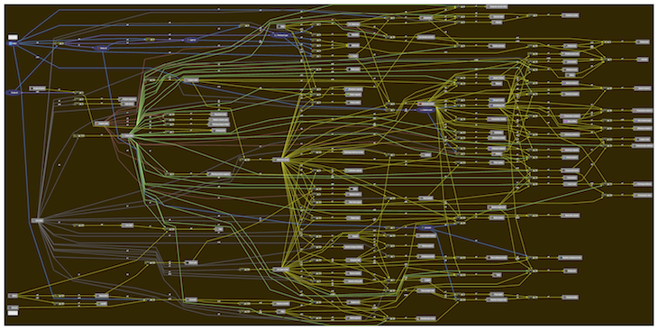

# Factorio Trees

This is a collection of Lua scripts that parse Factorio's data files and then use GraphViz to generate trees for recipe and technology dependencies. It does not add woody perennial plants to Factorio, sorry.

# Prerequisites

* Lua
* GraphViz

## Mac OS X

    brew install lua graphviz

# Run

    git clone https://github.com/ingmar/factorio-trees.git
    cd factorio-trees
    # Check FACTORIO_ROOT in the Makefile
    make
    open *.pdf
